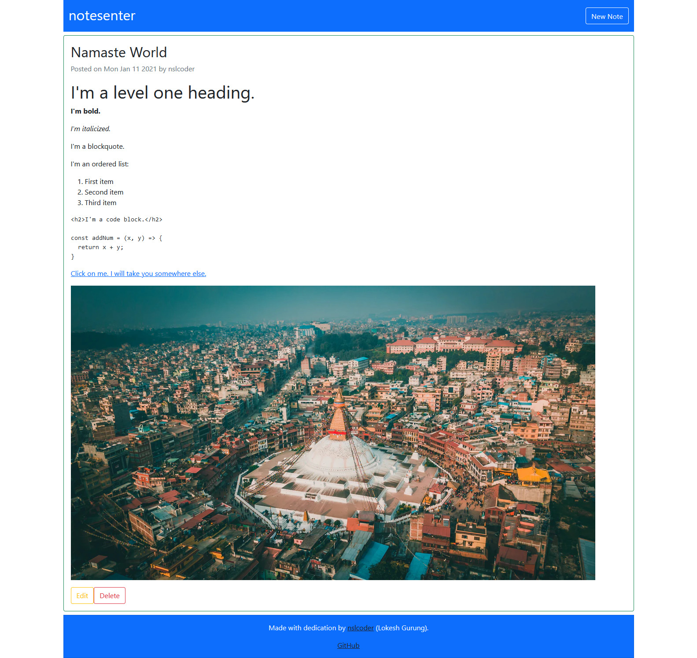

# notesenter

A simple Markdown note-taking app made in Node.js, Express, MongoDB and EJS.

## What I Learned:

- How to render the frontend in the server and send it to the browser (I used EJS and Bootstrap to build the view)
- How to configure the server to connect with MongoDB Atlas via Mongoose
- How to convert Markdown to HTML with Marked and sanitize HTML with DOMPurify and jsdom
- How to use pre hook validation 
- How to work around pre hooks for updates 
- How to use the HTTP methods PUT and DELETE in a HTML form with method-override 
- How to set up a database limit 
- How to deploy to Heroku

## Features:

- Create a new note
- Edit a note
- Delete a note
- Markdown support 

## Dependencies: 

- express
- mongoose
- ejs
- marked
- method-override
- dompurify
- jsdom
- dotenv

## Todos:

- [ ] Authentication and authorization
- [ ] Increase the number of notes a user can create
- [ ] Pagination 

## Blog Post:
If you want to learn how to create this API from scratch, please read [my post](https://nslpad.netlify.app/notesenter-markdown-app/).

## License
This project uses [the MIT License](https://github.com/nslcoder/notesenter/blob/main/LICENSE.md).
